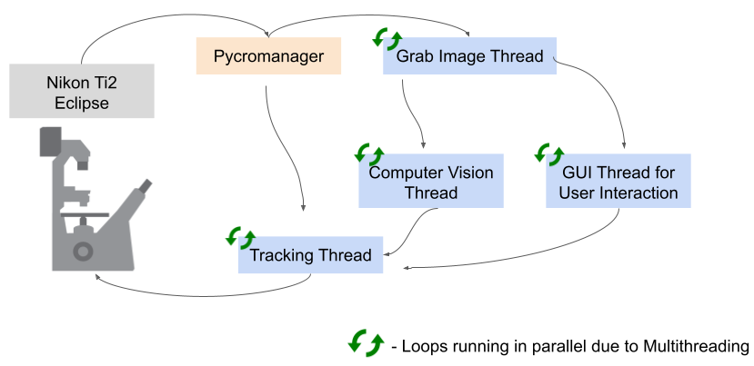

# Confocal Automated Tracking System

## Developed by Danish Islam and Hongruo Zhang
### Supervised by Dr. Mei Zhen at the Zhen Lab, Lunenfeld-Tanenbaum Research Institute

## Description

This program is a multithreaded application built on top of pycromanager to auto-track samples on the Nikon Ti2 Confocal Microscope. The front-end GUI allows you to view your sample and the performance of your computer vision model live, as well as the ability to stop/start tracking. It is used in conjunction with the Micro-Manager Beanshell Script for recording and saving the image data to your computer as a TIFF file (see repository I will add soon). Tracking involves velocity-control of the stage for smoother tracking with a proportional controller to minimize error between the current position and desired location from the computer vision model. Here is an overview of the program structure:



## Setting up project

1. Microscope set up with Micro-Manager 2.0 is required
2. Ensure velocity-control package is compatible with microscope stage (code is designed for Nikon Ti2 SDK)
3. Install dependencies
```pip install -r requirements.txt```
5. Run the tracking application
```python src/main.py```
